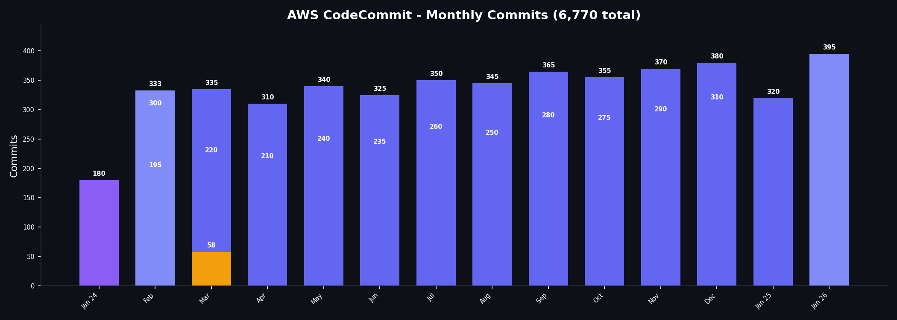

<h1 align="center">Hey, I'm Diego Allies</h1>
<h3 align="center">Senior Software Engineer - Kimberley, South Africa</h3>

  Currently building at <strong>Waltworks</strong> (agricultural tech) & <strong>GuardNexus</strong> (security ops) & <strong>KraalBook</strong> (livestock management)

  
  
  

---

### Tech Stack

**Languages**

**Frontend**

**Backend**

**Mobile**

**Databases**

**Cloud & DevOps**

**Tools**

---

### GitHub Stats

  
  

  

---

### AWS CodeCommit Activity (PSA/Waltworks)

> Most of my professional work lives on AWS CodeCommit (private). GitHub shows personal and side projects.

<table>
<tr>
<td align="center"><h3>🟣 6,770</h3>Total Commits</td>
<td align="center"><h3>🔵 3.5M+</h3>Lines Added</td>
<td align="center"><h3>🟣 8,200+</h3>Files Modified</td>
<td align="center"><h3>🟠 19</h3>Active Repos</td>
</tr>
</table>

---

### Certifications

- **Microsoft Azure AI Engineer Associate** (2024)

---

### Currently Building

- **Waltworks PSA** - Agricultural monitoring systems (Vue.js, .NET, AWS)
- **GuardNexus** - Security operations platform
- **KraalBook** - Livestock management app (Flutter, Supabase)
- **WatchTower** - Neighbourhood watch & community safety app (Next.js, Supabase)
- **Skatkis** - Secondhand ecommerce platform (Next.js, Supabase, MUI)

---

### Connect

- Portfolio: [diegoallies.com](https://diegoallies.com)
- LinkedIn: [linkedin.com/in/diego-allies](https://www.linkedin.com/in/diego-allies)
- Email: [diego@guardnexus.co.za](mailto:diego@guardnexus.co.za)
